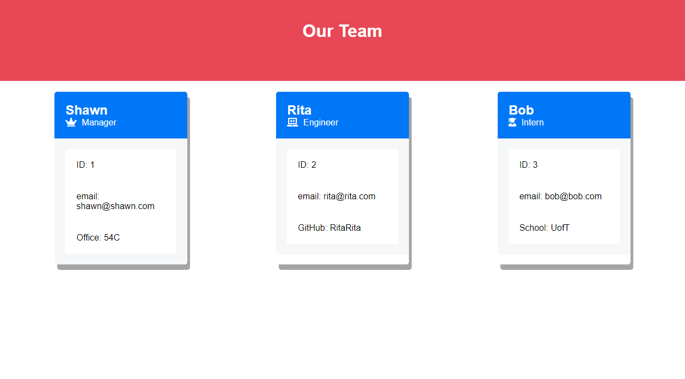

# Team Portfolio Generator

## Description

Creates a website of Team Members based upon Command Line input from the user.

## Screenshot

## Table of Contents 

* [Installation](#installation)
* [Usage](#usage)
* [License](#license)

## Installation

To install clone the project from github and then npm init.

## Usage

Run 'node index' from the root directory. You will be prompted for Team Member name, email, role and any role-specific information. Once complete, an HTML file and corresponding CSS file will be created in the dis/ folder. 

## License

This project uses the GNU General Public License. More info about this license can be found at https://www.gnu.org/licenses/gpl-3.0
    
## Questions

For additional information on this project contact me by email at shawnevans.music@gmail.com or visit my GitHub page at https://github.com/bluesatyr.